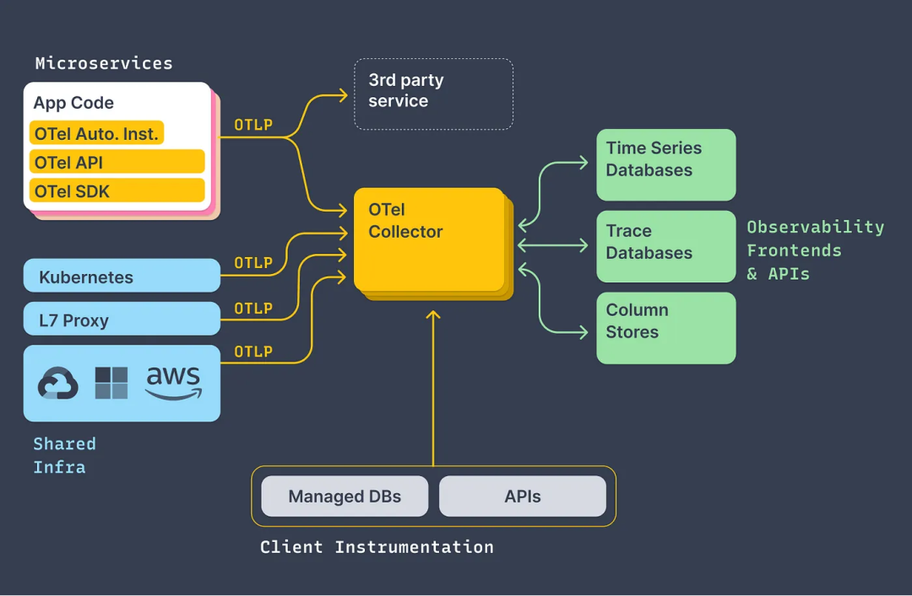

# OpenTelemetry

（简称 Otel） 是一个用于观察性的开源项目，提供了一套工具、APIs（是一个编程接口，可以使用它来检测代码以收集遥测数据，如跟踪、指标和日志） 和 SDKs(是 OpenTelemetry API 的官方实现，用于处理和将收集的遥测数据导出到后端)，用于收集、处理和导出遥测数据（如指标、日志和追踪信息）。

应用程序遥测数据（如追踪、指标和日志）的收集是通过探针来完成的，探针通常以库的形式集成到应用程序中，自动捕获重要信息协助监控和调试。OpenTelemetry 探针支持市面上大多数的编程语言，探针的安装（通常被称为插桩，Instrumentation）分为手动和自动两种方式。

OpenTelemetry 可以用于从应用程序收集数据。它是一组工具、API 和 SDK 集合，我们可以使用它们来检测、生成、收集和导出遥测数据（指标、日志和追踪），以帮助分析应用的性能和行为。

## 组件介绍

<figure><figcaption></figcaption></figure>

* **Microservices**：这是指由多个小型、自治服务组成的系统，每个服务都可以独立部署和扩展。
  * **App Code  OTel Auto Inst. OTel API, OTel SDK**: 这些是与应用代码相关的工具和服务，用于自动安装OpenTelemetry库并提供API访问。
* **Kubernetes, L7 Proxy, AWS, Shared Infra**: Kubernetes是一个容器编排平台，L7 Proxy是一种网络代理层，AWS是一家云服务商，Shared Infra表示共享基础设施（可能是公共或私有）。
* **3rd party service**: 这是指外部提供的服务，可能包括时间序列数据库、跟踪数据库等。
* **Time Series Databases, Trace Databases, Column Stores**: 这些都是存储数据的不同方式，适用于不同的场景需求。
* **Observability Frontends & APIs**: 这指的是观测性前端界面和应用程序接口，帮助用户查看和分析收集的数据。
* **Managed DBs, APIs**: 管理型数据库提供了更高级别的管理支持，而API则允许其他软件通过特定协议进行通信。
