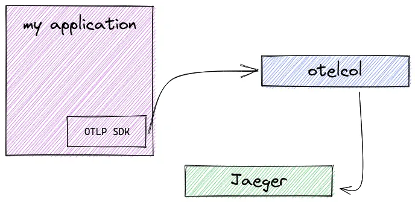
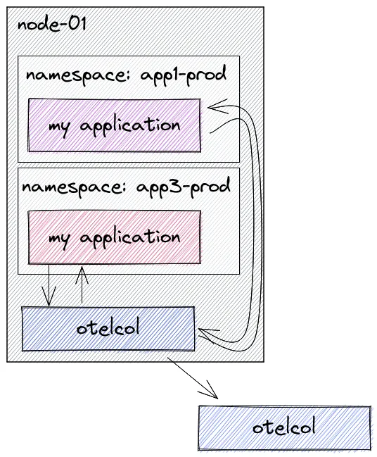

# OpenTelemetry Collector 部署模式/策略

### Agent 模式

在这种情况下，OpenTelemetry 检测的应用程序将数据发送到与应用程序一起驻留的（收集器）代理。然后，该代理程序将接管并处理所有来自应用程序的追踪数据。

收集器可以通过 sidecar 方式部署为代理，sidecar 可以配置为直接将数据发送到存储后端。

<figure><figcaption></figcaption></figure>

### Gateway 模式

还可以决定将数据发送到另一个 OpenTelemetry 收集器，然后从（中心）收集器进一步将数据发送到存储后端。在这种配置中，我们有一个中心的 OpenTelemetry 收集器，它使用 deployment 模式部署，具有许多优势，如自动扩展。

<figure><figcaption></figcaption></figure>

使用中心收集器的一些优点是：

* 消除对团队的依赖
* 强制执行批处理、重试、加密、压缩的配置/策略
* 在中心位置进行身份验证
* 丰富的元数据信息
* 进行抽样决策
* 通过 HPA 进行扩展

### 部署模式总结

**基本版**

客户端使用 OTLP 进行检测，将数据发送到一组收集器。

<figure><figcaption></figcaption></figure>

可以将数据发送到多个导出器。

<figure><figcaption></figcaption></figure>

在 Kubernetes 上部署 OpenTelemetry Collector 时可以使用的模式。

**sidecar 模式：**

代理作为 sidecar，其中使用 OpenTelemetry Collector 将容器添加到工作负载 Pod。然后，该实例被配置为将数据发送到可能位于不同命名空间或集群中的外部收集器。

<figure><figcaption></figcaption></figure>

**daemonset 模式**

Agent 作为 DaemonSet，这样我们每个 Kubernetes 节点就有一个代理 pod。

<figure><figcaption></figcaption></figure>

**负载均衡**

基于 trace id 的负载均衡：

<figure><figcaption></figcaption></figure>

**多集群模式**

代理、工作负载和控制平面收集器：

<figure><figcaption></figcaption></figure>

**多租户模式**

两个租户，每个租户都有自己的 Jaeger。

<figure><figcaption></figcaption></figure>

**信号模式**

两个收集器，每个收集器对应一种遥测数据类型。

<figure><figcaption></figcaption></figure>

\
