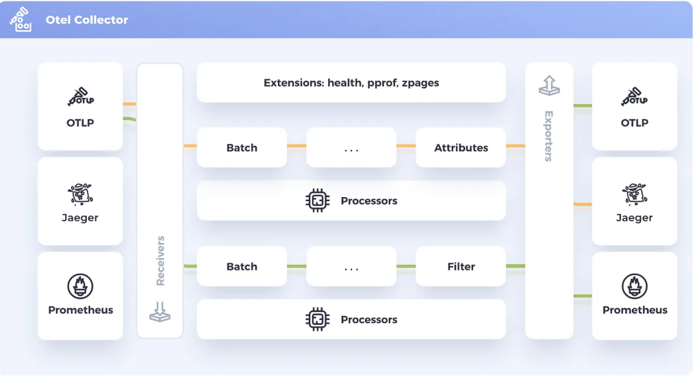
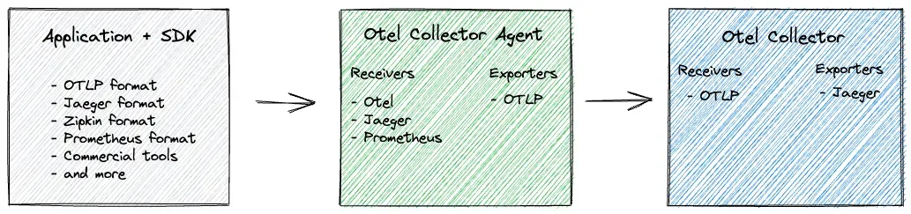

# OpenTelemetry Collectors

应用程序的遥测数据可以发送到 OpenTelemetry Collectors 收集器。

<figure><figcaption></figcaption></figure>

收集器是 OpenTelemetry 的一个组件，它接收遥测数据（span、metrics、logs 等），处理（预处理数据）并导出数据（将其发送到想要的通信后端）。

<figure><figcaption></figcaption></figure>

### 5.2 Receivers

接收器 Receivers 是数据进入收集器的方式，可以是推送或拉取。OpenTelemetry 收集器可以以多种格式接收遥测数据。

<figure><figcaption></figcaption></figure>

以下是接收器在端口 4317(gRPC) 和 4318(http) 上接受 OTLP 数据的配置示例：

```
otlp:
  protocols:
    http:
    grpc:
      endpoint: "0.0.0.0:4317"
```

同样下面的示例，它可以以 Jaeger Thrift HTTP 协议方式接收遥测数据。

```
jaeger: # Jaeger 协议接收器
  protocols: # 定义接收器支持的协议
    thrift_http: # 通过 Jaeger Thrift HTTP 协议接收数据
      endpoint: "0.0.0.0:14278"
```

### 5.3 Processors

一旦接收到数据，收集器就可以处理数据。处理器在接收和导出之间处理数据。处理器是可选的，但有些是推荐的。

比如 batch 处理器是非常推荐的。批处理器接收跨度、指标或日志，并将它们放入批次中。批处理有助于更好地压缩数据，减少传输数据所需的传出连接数量。该处理器支持基于大小和时间的批处理。

```
processors:
  batch:
```

需要注意的是配置处理器并不会启用它。需要通过 service 部分的 pipelines 启用。

```
service:
  pipelines:
    traces:
      receivers: [jaeger]
      processors: [batch]
      exporters: [zipkin]
```

### 5.4 Exporters

为了可视化和分析遥测数据，我们还需要使用导出器。导出器是 OpenTelemetry 的一个组件，也是数据发送到不同系统/后端的方式。

比如 console exporter 是一种常见的导出器，对于开发和调试任务非常有用，它会将数据打印到控制台。

在 exporters 部分，可以添加更多目的地。例如，如果想将追踪数据发送到 Grafana Tempo（是一个新的开源、易于使用的大容量分布式跟踪后端。Grafana 的 Tempo 是出自 Grafana 实验室的一个简单易用、大规模的、分布式的跟踪后端。Tempo 集成了 Grafana、Prometheus 以及 Loki，并且它只需要对象存储进行操作，因此成本低廉，操作简单。），只需添加如下所示的配置：

```
exporters:
  logging:
  otlp:
    endpoint: "<tempo_endpoint>"
    headers:
      authorization: Basic <api_token>
```

当然最终要生效也需要在 service 部分的 pipelines 中启用。

```
service:
  pipelines:
    traces:
      receivers: [otlp]
      processors: []
      exporters: [logging, otlp]
```

OpenTelemetry 附带了各种导出器，在 OpenTelemetry 收集器 Contrib 存储库中可以找到。

### 5.5 Extensions

扩展主要用于不涉及处理遥测数据的任务。比如健康监控、服务发现和数据转发等。扩展是可选的。

```
extensions:
  health_check:
  pprof:
  zpages:
  memory_ballast:
    size_mib: 512
```

\
