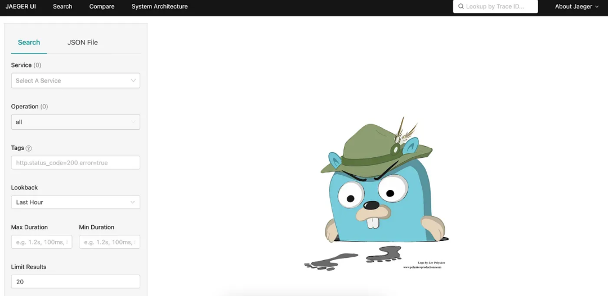

# OpenTelemetry 后端

OpenTelemetry 收集器并不提供自己的后端，所以可以使用任何供应商或开源产品！


<figure><figcaption></figcaption></figure>

> 尽管 OpenTelemetry 不提供自己的后端，但通过使用它，我们不会依赖于任何工具或供应商，因为它与供应商无关。我们不仅可以使用我们想要的任何编程语言，而且还可以选择存储后端，并且只需配置另一个导出器即可轻松切换到另一个后端/供应商。

为了可视化和分析遥测数据，我们只需要在 OpenTelemetry 采集器中配置一个导出器。

比如 Jaeger 就是一个非常流行的用于分析和查询数据的开源产品。

我们可以在 OpenTelemetry 收集器中配置 Jaeger 导出器，以便将数据发送到 Jaeger。

```
exporters:
  jaeger:
    endpoint: "http://localhost:14250"
```

\
