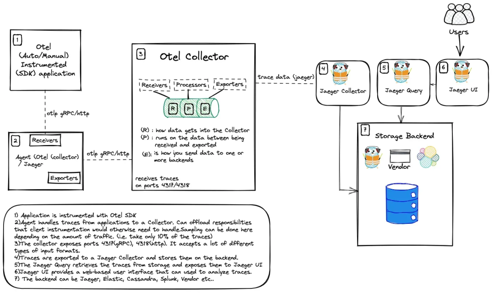

# OpenTelemetry检测（埋点）

应用程序的检测数据可以使用自动或手动（或混合）方式生成。 要使用 OpenTelemetry 检测应用程序，可以前往访问 OpenTelemetry 存储库，选择适用于的应用程序的语言，然后按照说明进行操作。

## 3.1 自动检测

使用自动检测是一个很好的方式，因为它简单、容易，不需要进行很多代码更改。

如果你没有必要的知识（或时间）来创建适合你应用程序量身的追踪代码，那么这种方法就非常合适。

当使用自动检测时，将创建一组预定义的 spans，并填充相关属性。

### 3.2 手动检测

手动检测是指为应用程序编写特定的埋点代码。这是向应用程序添加可观测性代码的过程。这样做可以更有效地满足你的需求，因为可以自己添加属性和事件。这样做的缺点是需要导入库并自己完成所有工作。

<figure><figcaption></figcaption></figure>

1. 应用程序被OpenTelemetry SDK instrumented（流行框架和库的插件）：这一步骤涉及在需要进行追踪的应用程序中添加必要的代码以启用OpenTelemetry的功能。SDK会生成追踪上下文并将它们发送到收集器。
2. 收集器接收来自应用程序的追踪事件：一旦应用程序开始产生追踪上下文，它就会将这些事件发送给位于同一台机器上的OpenTelemetry收集器。这个过程通常发生在gRPC/HTTP调用之间。
3. OpenTelemetry收集器暴露两个端口：4317(gRPC) 和 4318(HTTP)，分别接受不同类型的输入格式。收集器在此阶段主要负责从客户端接收到的所有追踪事件。
4. 收集器将追踪数据导出至Jaeger收集器：收集器现在将接收到的追踪数据转发到Jaeger收集器。Jaeger收集器随后将其保存在其内部存储结构中以便后续查询和其他操作。
5. Jaeger UI 提供了一个基于Web的用户界面：此UI使用户能够浏览和分析存储在Jaeger后端的各种追踪数据。
6. Jaeger Query检索追踪数据并显示结果：当用户想要查找特定的追踪时，他们可以通过JaegerQuery向Jaeger后端发出请求。该查询返回所有匹配的结果并在Jaeger UI上展示出来。

## 3.3 传播器

Context Propagation(上下文传播) Context propagation 确保相关的上下文数据(如 trace IDs、span IDs 和其他元数据)在应用程序的不同服务和组件之间一致地传播。

通过传播上下文，OpenTelemetry 确保从不同服务和组件收集的遥测数据保持相关，即使在分布式和微服务架构中也是如此。它支持端到端跟踪，从而更容易理解请求流、性能瓶颈和系统依赖关系。

可以将 W3C trace context、baggage 和b3 等传播器（Propagators）添加到配置中。

> 不同的传播器定义特定的行为规范，以便跨进程边界传播带上上下文数据。

* Trace Context：用于在 HTTP headers 中编码 trace 数据，以便在不同的服务间传递这些数据。
* Baggage：用于在 span 之间传递键值对数据，例如用户 ID、请求 ID 等。
* B3：用于在 HTTP headers 中编码 trace 数据，以便在不同的服务间传递这些数据（主要用于 Zipkin 或其兼容的系统）。

## 四、OpenTelemetry 协议（OTLP）

在 OpenTelemetry 的架构中，OTLP（OpenTelemetry Protocol）作为一种标准化的协议，用于在不同的组件之间传输遥测数据。具体来说：

* 代理（或者在这里指的是使用 OpenTelemetry SDK 的应用）：这些应用会生成或捕获遥测数据，如 traces、metrics 和 logs。为了将这些数据发送出去，代理需要配置一个 OTLP 导出器。这个导出器负责将原始的遥测数据按照 OTLP 规范进行编码和打包，以便于在网络中传输。
* 收集器（OpenTelemetry Collector）：收集器是一个独立的服务，其主要职责是接收、处理和转发遥测数据。为了能够接收通过 OTLP 协议发送来的数据，收集器需要配置一个 OTLP 接收器。这个接收器监听特定的网络端口，等待来自代理的 OTLP 数据包，并将接收到的数据解码和解析为可处理的格式。

代理通过配置的 OTLP 导出器将遥测数据以 OTLP 格式发送出去，而收集器则通过配置的 OTLP 接收器来接收和处理这些数据。这样，OTLP 就成为了一个桥梁，实现了遥测数据在不同系统和组件之间的高效、标准化传输。
