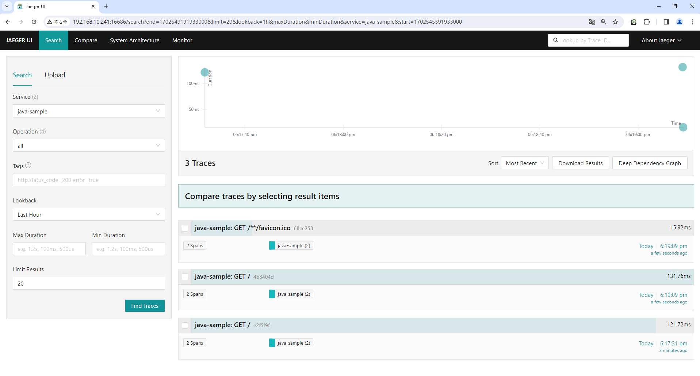

# JAVA项目案例

为 Pod 添加注解 instrumentation.opentelemetry.io/inject-java: "true" 通知 Otel Operator 该应用的类型以便注入正确的探针。

```
# cat > java-sample.yaml << EOF
apiVersion: apps/v1
kind: Deployment
metadata:
  name: java-sample
spec:
  replicas: 1
  selector:
    matchLabels:
      app: java-sample
  template:
    metadata:
      labels:
        app: java-sample
      annotations:
        instrumentation.opentelemetry.io/inject-java: "true"
    spec:
      containers:
      - name: java-sample
        image: pinakispecial/spring-boot-rest
        ports:
        - containerPort: 8080
---
apiVersion: v1
kind: Service
metadata:
  name: java-sample
spec:
  type: LoadBalancer
  ports:
  - port: 8080
    targetPort: 8080
    protocol: TCP
    name: http
  selector:
    app: java-sample
EOF
```

```
# kubectl apply -f java-sample.yaml
deployment.apps/java-sample created
service/java-sample created
```

```
# kubectl get pods
NAME                              READY   STATUS     RESTARTS   AGE
......
java-sample-6895889c64-4jqnw      0/1     Init:0/1   0          15s
```

```
# kubectl get pods
NAME                              READY   STATUS    RESTARTS   AGE
......
java-sample-6895889c64-4jqnw      1/1     Running   0          41s
```

```
# kubectl get service
NAME                        TYPE           CLUSTER-IP      EXTERNAL-IP      PORT(S)                                                         AGE
......
java-sample                 LoadBalancer   10.99.175.163   192.168.10.242   8080:30727/TCP                                                  97s
```

```
# kubectl get pods java-sample-6895889c64-wx6ns -o yaml
apiVersion: v1
kind: Pod
metadata:
  annotations:
    cni.projectcalico.org/containerID: a13f4fcd5c7277ca467ae3be00da845944c8959f58bdfe199cf08515a38ef813
    cni.projectcalico.org/podIP: 10.244.69.243/32
    cni.projectcalico.org/podIPs: 10.244.69.243/32
    instrumentation.opentelemetry.io/inject-java: "true"
  creationTimestamp: "2023-12-14T10:12:47Z"
  generateName: java-sample-6895889c64-
  labels:
    app: java-sample
    pod-template-hash: 6895889c64
  name: java-sample-6895889c64-wx6ns
  namespace: default
  ownerReferences:
  - apiVersion: apps/v1
    blockOwnerDeletion: true
    controller: true
    kind: ReplicaSet
    name: java-sample-6895889c64
    uid: fc0a7f47-2dae-4b25-9082-5c6d65216858
  resourceVersion: "269172"
  uid: 4d5f4567-6b85-4194-8922-6940f9d18c87
spec:
  containers:
  - env:
    - name: OTEL_EXPORTER_OTLP_ENDPOINT
      value: http://otel-collector.default.svc.cluster.local.:4317
    - name: JAVA_TOOL_OPTIONS
      value: ' -javaagent:/otel-auto-instrumentation-java/javaagent.jar'
    - name: OTEL_SERVICE_NAME
      value: java-sample
    - name: OTEL_RESOURCE_ATTRIBUTES_POD_NAME
      valueFrom:
        fieldRef:
          apiVersion: v1
          fieldPath: metadata.name
    - name: OTEL_RESOURCE_ATTRIBUTES_NODE_NAME
      valueFrom:
        fieldRef:
          apiVersion: v1
          fieldPath: spec.nodeName
    - name: OTEL_PROPAGATORS
      value: tracecontext,baggage,b3
    - name: OTEL_TRACES_SAMPLER
      value: parentbased_traceidratio
    - name: OTEL_TRACES_SAMPLER_ARG
      value: "1"
    - name: OTEL_RESOURCE_ATTRIBUTES
      value: k8s.container.name=java-sample,k8s.deployment.name=java-sample,k8s.namespace.name=default,k8s.node.name=$(OTEL_RESOURCE_ATTRIBUTES_NODE_NAME),k8s.pod.name=$(OTEL_RESOURCE_ATTRIBUTES_POD_NAME),k8s.replicaset.name=java-sample-6895889c64
    image: pinakispecial/spring-boot-rest
    imagePullPolicy: Always
    name: java-sample
    ports:
    - containerPort: 8080
      protocol: TCP
    resources: {}
    terminationMessagePath: /dev/termination-log
    terminationMessagePolicy: File
    volumeMounts:
    - mountPath: /var/run/secrets/kubernetes.io/serviceaccount
      name: kube-api-access-4m4jt
      readOnly: true
    - mountPath: /otel-auto-instrumentation-java
      name: opentelemetry-auto-instrumentation-java
  dnsPolicy: ClusterFirst
  enableServiceLinks: true
  initContainers:
  - command:
    - cp
    - /javaagent.jar
    - /otel-auto-instrumentation-java/javaagent.jar
    image: ghcr.io/open-telemetry/opentelemetry-operator/autoinstrumentation-java:1.32.0
    imagePullPolicy: IfNotPresent
    name: opentelemetry-auto-instrumentation-java
    resources:
      limits:
        cpu: 500m
        memory: 64Mi
      requests:
        cpu: 50m
        memory: 64Mi
    terminationMessagePath: /dev/termination-log
    terminationMessagePolicy: File
    volumeMounts:
    - mountPath: /otel-auto-instrumentation-java
      name: opentelemetry-auto-instrumentation-java
    - mountPath: /var/run/secrets/kubernetes.io/serviceaccount
      name: kube-api-access-4m4jt
      readOnly: true
  nodeName: k8s-worker02
  preemptionPolicy: PreemptLowerPriority
  priority: 0
  restartPolicy: Always
  schedulerName: default-scheduler
  securityContext: {}
  serviceAccount: default
  serviceAccountName: default
  terminationGracePeriodSeconds: 30
  tolerations:
  - effect: NoExecute
    key: node.kubernetes.io/not-ready
    operator: Exists
    tolerationSeconds: 300
  - effect: NoExecute
    key: node.kubernetes.io/unreachable
    operator: Exists
    tolerationSeconds: 300
  volumes:
  - name: kube-api-access-4m4jt
    projected:
      defaultMode: 420
      sources:
      - serviceAccountToken:
          expirationSeconds: 3607
          path: token
      - configMap:
          items:
          - key: ca.crt
            path: ca.crt
          name: kube-root-ca.crt
      - downwardAPI:
          items:
          - fieldRef:
              apiVersion: v1
              fieldPath: metadata.namespace
            path: namespace
  - emptyDir:
      sizeLimit: 200Mi
    name: opentelemetry-auto-instrumentation-java
status:
  conditions:
  - lastProbeTime: null
    lastTransitionTime: "2023-12-14T10:12:49Z"
    status: "True"
    type: Initialized
  - lastProbeTime: null
    lastTransitionTime: "2023-12-14T10:12:53Z"
    status: "True"
    type: Ready
  - lastProbeTime: null
    lastTransitionTime: "2023-12-14T10:12:53Z"
    status: "True"
    type: ContainersReady
  - lastProbeTime: null
    lastTransitionTime: "2023-12-14T10:12:47Z"
    status: "True"
    type: PodScheduled
  containerStatuses:
  - containerID: docker://f1dde18e580d6574f588ca32c837e95523c848b83ed73b317c5133ffb0dd28be
    image: pinakispecial/spring-boot-rest:latest
    imageID: docker-pullable://pinakispecial/spring-boot-rest@sha256:0e3052dbe6d5fd8935b7f2f344f6241a3117b4fe86cb86ac3d1451b9117d4af0
    lastState: {}
    name: java-sample
    ready: true
    restartCount: 0
    started: true
    state:
      running:
        startedAt: "2023-12-14T10:12:52Z"
  hostIP: 192.168.10.164
  initContainerStatuses:
  - containerID: docker://3543870aeebd02fd4494181d73e93070848ef23cb8b85377777d183fd8925097
    image: ghcr.io/open-telemetry/opentelemetry-operator/autoinstrumentation-java:1.32.0
    imageID: docker-pullable://ghcr.io/open-telemetry/opentelemetry-operator/autoinstrumentation-java@sha256:4e5b3cbc3d89ead3bf21b271e02bf241ebbfca1bdf061f781cabcc490549bf0c
    lastState: {}
    name: opentelemetry-auto-instrumentation-java
    ready: true
    restartCount: 0
    started: false
    state:
      terminated:
        containerID: docker://3543870aeebd02fd4494181d73e93070848ef23cb8b85377777d183fd8925097
        exitCode: 0
        finishedAt: "2023-12-14T10:12:48Z"
        reason: Completed
        startedAt: "2023-12-14T10:12:48Z"
  phase: Running
  podIP: 10.244.69.243
  podIPs:
  - ip: 10.244.69.243
  qosClass: Burstable
  startTime: "2023-12-14T10:12:47Z"
```

可以看到 Otel Operator 向 Pod 中注入了一个 otel 的初始化容器。

```
# kubectl describe pods java-sample-6895889c64-d9qpd
Name:             java-sample-6895889c64-d9qpd
Namespace:        default
Priority:         0
Service Account:  default
Node:             k8s-worker02/192.168.10.164
Start Time:       Thu, 14 Dec 2023 18:18:35 +0800
Labels:           app=java-sample
                  pod-template-hash=6895889c64
Annotations:      cni.projectcalico.org/containerID: 16f8dbbc0a97b96009a1f991af8f698f8ed7717195564aa927f396db98eaa269
                  cni.projectcalico.org/podIP: 10.244.69.244/32
                  cni.projectcalico.org/podIPs: 10.244.69.244/32
                  instrumentation.opentelemetry.io/inject-java: true
Status:           Running
IP:               10.244.69.244
IPs:
  IP:           10.244.69.244
Controlled By:  ReplicaSet/java-sample-6895889c64
Init Containers:
  opentelemetry-auto-instrumentation-java:
    Container ID:  docker://6c8c3a35c2193d93a61150812132e67416b24b8d0833b79ea8d2a225273de40f
    Image:         ghcr.io/open-telemetry/opentelemetry-operator/autoinstrumentation-java:1.32.0
    Image ID:      docker-pullable://ghcr.io/open-telemetry/opentelemetry-operator/autoinstrumentation-java@sha256:4e5b3cbc3d89ead3bf21b271e02bf241ebbfca1bdf061f781cabcc490549bf0c
    Port:          <none>
    Host Port:     <none>
    Command:
      cp
      /javaagent.jar
      /otel-auto-instrumentation-java/javaagent.jar
    State:          Terminated
      Reason:       Completed
      Exit Code:    0
      Started:      Thu, 14 Dec 2023 18:18:36 +0800
      Finished:     Thu, 14 Dec 2023 18:18:36 +0800
    Ready:          True
    Restart Count:  0
    Limits:
      cpu:     500m
      memory:  64Mi
    Requests:
      cpu:        50m
      memory:     64Mi
    Environment:  <none>
    Mounts:
      /otel-auto-instrumentation-java from opentelemetry-auto-instrumentation-java (rw)
      /var/run/secrets/kubernetes.io/serviceaccount from kube-api-access-5wphg (ro)
Containers:
  java-sample:
    Container ID:   docker://b5e00c3c8428cbb7118c39aaeeb06214d1e825b677ec86a0923fdf8671ce9d5e
    Image:          pinakispecial/spring-boot-rest
    Image ID:       docker-pullable://pinakispecial/spring-boot-rest@sha256:0e3052dbe6d5fd8935b7f2f344f6241a3117b4fe86cb86ac3d1451b9117d4af0
    Port:           8080/TCP
    Host Port:      0/TCP
    State:          Running
      Started:      Thu, 14 Dec 2023 18:18:46 +0800
    Ready:          True
    Restart Count:  0
    Environment:
      OTEL_EXPORTER_OTLP_ENDPOINT:         http://otel-collector.default.svc.cluster.local.:4317
      JAVA_TOOL_OPTIONS:                    -javaagent:/otel-auto-instrumentation-java/javaagent.jar
      OTEL_SERVICE_NAME:                   java-sample
      OTEL_RESOURCE_ATTRIBUTES_POD_NAME:   java-sample-6895889c64-d9qpd (v1:metadata.name)
      OTEL_RESOURCE_ATTRIBUTES_NODE_NAME:   (v1:spec.nodeName)
      OTEL_PROPAGATORS:                    tracecontext,baggage,b3
      OTEL_TRACES_SAMPLER:                 parentbased_traceidratio
      OTEL_TRACES_SAMPLER_ARG:             1
      OTEL_RESOURCE_ATTRIBUTES:            k8s.container.name=java-sample,k8s.deployment.name=java-sample,k8s.namespace.name=default,k8s.node.name=$(OTEL_RESOURCE_ATTRIBUTES_NODE_NAME),k8s.pod.name=$(OTEL_RESOURCE_ATTRIBUTES_POD_NAME),k8s.replicaset.name=java-sample-6895889c64
    Mounts:
      /otel-auto-instrumentation-java from opentelemetry-auto-instrumentation-java (rw)
      /var/run/secrets/kubernetes.io/serviceaccount from kube-api-access-5wphg (ro)
Conditions:
  Type              Status
  Initialized       True
  Ready             True
  ContainersReady   True
  PodScheduled      True
Volumes:
  kube-api-access-5wphg:
    Type:                    Projected (a volume that contains injected data from multiple sources)
    TokenExpirationSeconds:  3607
    ConfigMapName:           kube-root-ca.crt
    ConfigMapOptional:       <nil>
    DownwardAPI:             true
  opentelemetry-auto-instrumentation-java:
    Type:        EmptyDir (a temporary directory that shares a pod's lifetime)
    Medium:
    SizeLimit:   200Mi
QoS Class:       Burstable
Node-Selectors:  <none>
Tolerations:     node.kubernetes.io/not-ready:NoExecute op=Exists for 300s
                 node.kubernetes.io/unreachable:NoExecute op=Exists for 300s
Events:
  Type    Reason     Age    From               Message
  ----    ------     ----   ----               -------
  Normal  Scheduled  2m53s  default-scheduler  Successfully assigned default/java-sample-6895889c64-d9qpd to k8s-worker02
  Normal  Pulled     2m52s  kubelet            Container image "ghcr.io/open-telemetry/opentelemetry-operator/autoinstrumentation-java:1.32.0" already present on machine
  Normal  Created    2m52s  kubelet            Created container opentelemetry-auto-instrumentation-java
  Normal  Started    2m52s  kubelet            Started container opentelemetry-auto-instrumentation-java
  Normal  Pulling    2m51s  kubelet            Pulling image "pinakispecial/spring-boot-rest"
  Normal  Pulled     2m42s  kubelet            Successfully pulled image "pinakispecial/spring-boot-rest" in 8.986s (8.986s including waiting)
  Normal  Created    2m42s  kubelet            Created container java-sample
  Normal  Started    2m42s  kubelet            Started container java-sample
```

在 java 容器中注入了一系列的环境变量进行配置。


<figure><figcaption></figcaption></figure>
