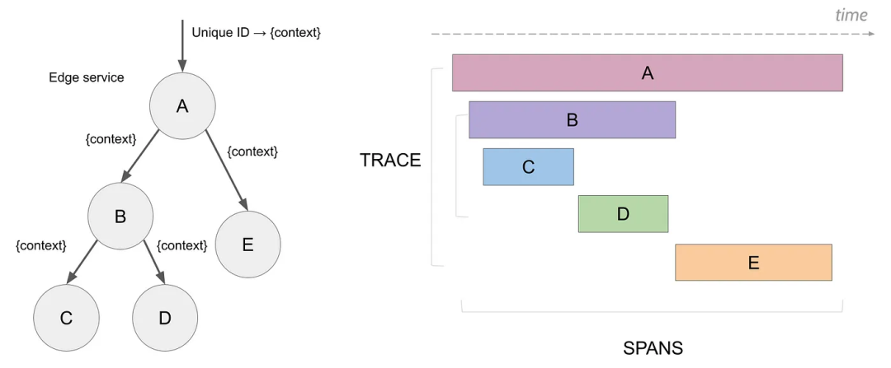

# 分布式系统中请求跟踪的必要性

## 为什么需要分布式跟踪？

随着SOA，微服务架构及PaaS，Devops等技术的兴起，线上问题的追踪和排查变得更加困难。对线上业务的可观测性得到了越来越多企业的重视，由此涌现出了许多优秀的链路追踪及服务监控中间件。比较流行的有Spring Cloud全家桶自带的Zipkin，点评的CAT, 华为的skywalking，Uber的Jaeger, naver的Pinpoint。

一个典型的应用，通常有三种类型的数据需要被监控系统记录：Metric, logs and traces。让我们先了解下它们都是什么。



提供进行运行时的指标信息。比如CPU使用率，内存使用情况，GC情况，网站流量等。



可以监控程序进程中的日志，比如集成Log4j记录的日志，或者程序运行中发生的事件或通知。



也叫做分布式追踪，包含请求中每个子操作的开始和结束时间，传递的参数，请求间的调用链路，请求在各个链路上的耗时等信息。Tracing可以包含消息发送和接收，数据库访问，负载均衡等各种信息，让我们可以深入了解请求的执行情况。Tracing为我们提供了获取请求的时间主要消耗在哪里，请求的参数都是什么，如果发生了异常，那么异常是在哪个环节产生的等能力。



我们为什么需要分布式追踪？为什么我们不能只使用指标和日志呢？假设你有一个如下所示的微服务架构。

<figure><figcaption></figcaption></figure>

现在想象一下来自客户端的请求。

从上面的架构图中我们可以看出，一个请求可能要经过几十个或几百个网络调用。这使得我们很难知道请求所经过的整个路径，如果只有日志和指标，那么故障排查会非常复杂。

分布式跟踪可以帮助查看整个请求过程中服务之间的交互，并可以让我们深入了解系统中请求的整个生命周期。它帮助我们发现应用程序中的错误、瓶颈和性能问题。

追踪从用户与应用程序进行交互的一刻开始，我们应该能够看到整个请求直到最后一层。

跟踪数据（以 span 的形式，跨度表示一个工作或操作单元。跨度是痕迹的组成部分。）生成信息（元数据），可以帮助了解请求延迟或错误是如何发生的，以及它们对整个请求会产生什么样的影响。

<figure><figcaption></figcaption></figure>

在分布式系统中，请求跟踪（Request Tracing）是非常重要的，原因如下：

1. **故障诊断**：分布式系统中，服务调用链可能涉及多个微服务或组件。如果某个服务出现故障或延迟，跟踪请求可以帮助迅速定位问题的根源，找出哪个服务或哪段代码导致了故障。
2. **性能优化**：通过请求跟踪，可以监控每个微服务的响应时间和性能瓶颈。这有助于识别和优化系统中的低效部分，从而提升整体性能。
3. **可视化调用链**：请求跟踪可以生成服务之间调用关系的可视化图表，使开发人员和运维人员清晰了解服务之间的依赖关系和交互模式。
4. **提高系统可靠性**：跟踪请求有助于及时发现和解决系统中的潜在问题，提升系统的可靠性和稳定性。
5. **日志关联**：在分布式系统中，各个服务的日志分散在不同的地方。请求跟踪可以为每个请求分配一个唯一的ID，通过这个ID将不同服务的日志关联起来，便于集中分析和排查问题。

**分布式系统中**<mark style="color:orange;">**请求跟踪**</mark>**与**<mark style="color:purple;">**指标和日志**</mark>**的区别？**

1. **指标和日志信息的广角镜头 vs. 请求跟踪的长焦镜头**：
   * **指标和日志信息**：这些数据通常是全局化和扁平化的，提供了系统整体的健康状况、性能指标和日志记录。这些信息就像是观察系统的“广角镜头”，可以让我们了解系统的总体运行情况。
   * **请求跟踪**：对于复杂请求的完整过程，指标和日志可能不足以提供详细的视角。请求跟踪相当于一个“长焦镜头”，它能够深入到单个请求的每一步，详细记录请求在系统中的路径、各个服务的响应时间、调用的顺序和依赖关系。
2. **复杂分布式系统中的请求处理**：
   * **多个服务、多台机器、多次调用**：在复杂的分布式系统中，客户端的一次请求可能会经过多个服务、多个中间件和多台机器的相互协作。这些服务可能有串行调用（一个接一个的调用）和并行调用（同时调用多个服务）。
   * **确定调用链**：要确定客户端的一次操作背后调用了哪些服务、经过了哪些节点、每个模块的调用先后顺序以及每个模块的性能问题，需要借助请求跟踪工具。这些工具可以记录和可视化完整的调用链。
   * **处理异常**：当某个请求出现调用失败时，用户通常只能看到异常本身的信息。要定位异常发生的位置及相关细节，需要分析本次请求相关的每个服务日志。没有请求跟踪工具的帮助，这个过程会非常复杂和低效。请求跟踪工具可以显著简化这个过程，通过跟踪ID快速定位问题并提供详细的调用路径信息。

综上：请求跟踪在分布式系统中扮演着至关重要的角色，它能够提供比传统的指标和日志更细粒度和更全面的洞察力，帮助开发者和运维人员更高效地诊断和解决问题。
