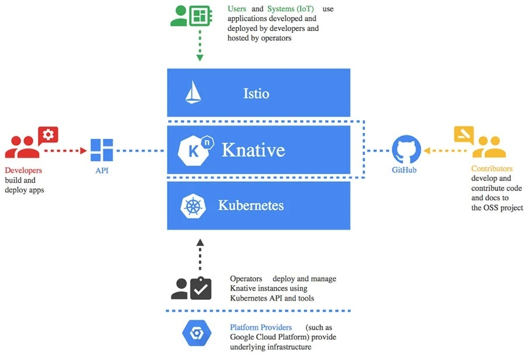

# serving

## knative serving部署

### 环境说明



> Master节点及Worker节点配置均为：CPU为8核，内存为8G。

```bash
[root@k8s-master01 ~]# kubectl get nodes
NAME           STATUS   ROLES                  AGE   VERSION
k8s-master01   Ready    control-plane,master   35h   v1.22.5
k8s-worker01   Ready    <none>                 34h   v1.22.5
k8s-worker02   Ready    <none>                 34h   v1.22.5
```





```
查看docker版本
# docker version
Client: Docker Engine - Community
 Version:           20.10.12
 API version:       1.41
 Go version:        go1.16.12
 Git commit:        e91ed57
 Built:             Mon Dec 13 11:45:41 2021
 OS/Arch:           linux/amd64
 Context:           default
 Experimental:      true
​
Server: Docker Engine - Community
 Engine:
  Version:          20.10.12
  API version:      1.41 (minimum version 1.12)
  Go version:       go1.16.12
  Git commit:       459d0df
  Built:            Mon Dec 13 11:44:05 2021
  OS/Arch:          linux/amd64
  Experimental:     false
 containerd:
  Version:          1.4.12
  GitCommit:        7b11cfaabd73bb80907dd23182b9347b4245eb5d
 runc:
  Version:          1.0.2
  GitCommit:        v1.0.2-0-g52b36a2
 docker-init:
  Version:          0.19.0
​
```





```bash
[root@k8s-master01 ~]# cat /etc/redhat-release
CentOS Linux release 7.9.2009 (Core)

[root@k8s-master01 ~]# uname -r
5.15.10-1.el7.elrepo.x86_64
```





<table data-header-hidden><thead><tr><th width="118"></th><th width="123"></th><th></th></tr></thead><tbody><tr><td>序号</td><td>服务</td><td>功能</td></tr><tr><td>1</td><td>Nginx</td><td>托管资源清单文件</td></tr><tr><td>2</td><td>DNS</td><td>提供域名解析</td></tr><tr><td>3</td><td>Harbor</td><td>提供容器镜像托管，需要证书，开放443端口</td></tr><tr><td>4</td><td>MetalLB</td><td>提供负载均衡功能</td></tr></tbody></table>



### 部署过程


部署参考官网：knative.dev

涉及下载等问题，使用vpn解决


#### serving




```bash
# wget https://github.com/knative/serving/releases/download/knative-v1.1.0/serving-crds.yaml

# kubectl apply -f serving-crds.yaml

查看输出结果
....

```




knative为版本1.1.0 按需修改


```bash
# wget https://github.com/knative/serving/releases/download/knative-v1.1.0/serving-core.yaml

# kubectl apply -f serving-core.yaml

查看输出结果
....

```






**查看命名空间是否创建**

```bash
# kubectl get ns
NAME                   STATUS   AGE
default                Active   34h
ingress-nginx          Active   27h
knative-serving        Active   41s
kube-node-lease        Active   34h
kube-public            Active   34h
kube-system            Active   34h
kubernetes-dashboard   Active   29h
metallb-system         Active   99m
```

**查看命名空间下所有资源对象创建情况**

```bash
# kubectl get all -n knative-serving
NAME                                         READY   STATUS    RESTARTS   AGE
pod/activator-57b466c6bd-k2cnc               1/1     Running   0          54s
pod/autoscaler-78475785dd-d4hxz              1/1     Running   0          54s
pod/controller-7478677c4c-hx2t6              1/1     Running   0          54s
pod/domain-mapping-5f75c74cd9-bsl82          1/1     Running   0          54s
pod/domainmapping-webhook-84587c4b68-lbwwd   1/1     Running   0          54s
pod/webhook-c7986985c-m26v5                  1/1     Running   0          53s
​
NAME                                 TYPE        CLUSTER-IP       EXTERNAL-IP   PORT(S)                           AGE
service/activator-service            ClusterIP   10.101.180.104   <none>        9090/TCP,8008/TCP,80/TCP,81/TCP   54s
service/autoscaler                   ClusterIP   10.107.210.10    <none>        9090/TCP,8008/TCP,8080/TCP        54s
service/autoscaler-bucket-00-of-01   ClusterIP   10.98.159.126    <none>        8080/TCP                          52s
service/controller                   ClusterIP   10.103.198.96    <none>        9090/TCP,8008/TCP                 54s
service/domainmapping-webhook        ClusterIP   10.107.211.218   <none>        9090/TCP,8008/TCP,443/TCP         53s
service/webhook                      ClusterIP   10.110.248.39    <none>        9090/TCP,8008/TCP,443/TCP         53s
​
NAME                                    READY   UP-TO-DATE   AVAILABLE   AGE
deployment.apps/activator               1/1     1            1           54s
deployment.apps/autoscaler              1/1     1            1           54s
deployment.apps/controller              1/1     1            1           54s
deployment.apps/domain-mapping          1/1     1            1           54s
deployment.apps/domainmapping-webhook   1/1     1            1           54s
deployment.apps/webhook                 1/1     1            1           53s
​
NAME                                               DESIRED   CURRENT   READY   AGE
replicaset.apps/activator-57b466c6bd               1         1         1       54s
replicaset.apps/autoscaler-78475785dd              1         1         1       54s
replicaset.apps/controller-7478677c4c              1         1         1       54s
replicaset.apps/domain-mapping-5f75c74cd9          1         1         1       54s
replicaset.apps/domainmapping-webhook-84587c4b68   1         1         1       54s
replicaset.apps/webhook-c7986985c                  1         1         1       53s
​
NAME                                            REFERENCE              TARGETS          MINPODS   MAXPODS   REPLICAS   AGE
horizontalpodautoscaler.autoscaling/activator   Deployment/activator   <unknown>/100%   1         20        1          54s
horizontalpodautoscaler.autoscaling/webhook     Deployment/webhook     <unknown>/100%   1         5         1          53s
```

**查看pod是否运行**

```bash
# kubectl get pod -n knative-serving
NAME                                     READY   STATUS    RESTARTS   AGE
activator-57b466c6bd-k2cnc               1/1     Running   0          112s
autoscaler-78475785dd-d4hxz              1/1     Running   0          112s
controller-7478677c4c-hx2t6              1/1     Running   0          112s
domain-mapping-5f75c74cd9-bsl82          1/1     Running   0          112s
domainmapping-webhook-84587c4b68-lbwwd   1/1     Running   0          112s
webhook-c7986985c-m26v5                  1/1     Running   0          111s
```





#### 2.2 istio 服务网格选择

> 注意：此处并不是安装istio，仅为定义istio安装类型及资源对象的创建

<figure><figcaption></figcaption></figure>

* Developers Serverless 服务的开发人员可以直接使用原生的 Kubernetes API 基于 Knative 部署 Serverless
* Contributors 主要是指社区的贡献者
* Operators Knative 可以被集成到任何支持的环境中，比如：云厂商、或者企业内部。目前 Knative 是基于 Kubernetes 来实现的，有 Kubernetes 的地方就可以部署 Knative
* Users 终端用户通过 Istio 网关访问服务，或者通过事件系统触发 Knative 中的 Serverless 服务




```
# wget https://github.com/knative/net-istio/releases/download/knative-v1.1.0/istio.yaml

确定使用何种方式部署istio
# kubectl apply -l knative.dev/crd-install=true -f istio.yaml

输出结果
...

创建istio在kubernetes集群中的资源对象
# kubectl apply -f istio.yaml

输出结果
....

```




下载knative istio控制器资源清单文件


```
# wget https://github.com/knative/net-istio/releases/download/knative-v1.1.0/net-istio.yaml

# kubectl apply -f net-istio.yaml

输出结果
....
```


#### 验证istio ingressgateway是否可用

```
查看在istio-system命名空间中创建的istio-ingressgateway资源对象
# kubectl get svc istio-ingressgateway -n istio-system
NAME                   TYPE           CLUSTER-IP      EXTERNAL-IP       PORT(S)                                      AGE
istio-ingressgateway   LoadBalancer   10.108.136.72   192.168.10.200  15021:30384/TCP,80:30504/TCP,443:31907/TCP   2m3s
```

查看输出结果，重点注意:EXTERNAL-IP，如果没有IP地址，表明负载均衡器（metallb）没有工作。



#### 通过打补丁把域名添加到configmap中

```
# kubectl patch configmap/config-domain \
--namespace knative-serving \
--type merge \
--patch '{"data":{"knative.kubemsb.com":""}}'
```

#### 使用本地永久性DNS配置

需要有本地DNS服务做支撑，如下：

```
注册域名
[root@dnsserver ~]# cat /etc/named.rfc1912.zones
......
zone "kubemsb.com" IN {
        type master;
        file "kubemsb.com.zone";
        allow-update { none; };
};
```

```
添加域名正向解析文件
[root@dnsserver ~]# cat /var/named/kbuemsb.com.zone
$TTL 1D
@       IN SOA  @ admin.kubemsb.com. (
                                        0       ; serial
                                        1D      ; refresh
                                        1H      ; retry
                                        1W      ; expire
                                        3H )    ; minimum
        NS      @
@       A       192.168.122.254
*.knative               A       192.168.10.200
```

```
通过编辑查看configmap中是否添加上述域名
# kubectl edit configmap/config-domain -n knative-serving
```

```
    # the label app=secret only exposed to the local cluster.
    svc.cluster.local: |
      selector:
        app: secret
增加了如下内容：
  knative.kubemsb.com: ""
```

#### 添加HPA实现自动缩放服务(可选)

Knative 还支持使用 Kubernetes Horizontal Pod Autoscaler (HPA) 来驱动自动缩放决策。


```
# wget  https://github.com/knative/serving/releases/download/knative-v1.1.0/serving-hpa.yaml

# kubectl apply -f serving-hpa.yaml

输入结果
deployment.apps/autoscaler-hpa created
service/autoscaler-hpa created
```






### 2.4 istio安装

#### 2.4.1 获取

> 下载链接：[https://github.com/istio/istio/releases/tag/1.12.0](https://github.com/istio/istio/releases/tag/1.12.0)

```
查看已下载的istio二进制包
# ls
istio-1.12.0  istio-1.12.0-linux-amd64.tar.gz
```

#### 2.4.2 定义变量

```
在当前终端中定义环境变量，如条件允许建议把环境变量定义至/etc/profile中，以实现永久生效。
# export ISTIOPATH=/root/istio/istio-1.12.0
# export PATH=$ISTIOPATH/bin:$PATH
# echo $PATH
/root/istio/istio-1.12.0/bin:/usr/local/sbin:/usr/local/bin:/usr/sbin:/usr/bin:/root/bin
```

#### 2.4.3 查看版本

```
使用istioctl客户端命令查看版本
# istioctl version
client version: 1.12.0
control plane version: 1.12.0
data plane version: 1.12.0 (3 proxies)
```

> 旧版本一定要删除，删除方法如下：

```
如存在旧版本，一定要使用下面的命令删除，永久删除。
# istioctl x uninstall --purge
```

#### 2.4.4 安装

```
使用istioctl命令安装istio,profile为demo
# istioctl install --set profile=demo -y
✔ Istio core installed
✔ Istiod installed
✔ Ingress gateways installed
✔ Egress gateways installed
✔ Installation complete                                                                                                               Making this installation the default for injection and validation.

Thank you for installing Istio 1.12.  Please take a few minutes to tell us about your install/upgrade experience!  https://forms.gle/FegQbc9UvePd4Z9z7
```

#### 2.4.5 开启注入功能

```
允许knative-serving命名空间中工作负载实现自动注入机制
# kubectl label namespace knative-serving istio-injection=enabled
namespace/knative-serving labeled
```

## 三、项目开发及部署

### 3.1 项目开发

> 需要提前准备idea集成开发工具，并创建spring boot项目。

#### 3.1.1 在idea中开发项目


```
下面的路径为Windows项目路径
# G:\projects\knative-demo\src\main\java\com\kubemsb\knativedemo\KnativeServingController.java


package com.kubemsb.knativedemo;

import org.springframework.beans.factory.annotation.Value;
import org.springframework.web.bind.annotation.RequestMapping;
import org.springframework.web.bind.annotation.RestController;

@RestController
public class KnativeServingController {

    @Value("${Target:World}")
    String Target;

    @RequestMapping("/")
    String Hello() {
        return "hello" + Target + "!";
    }
}
```

#### 3.1.2 在idea中运行项目并访问


#### 3.1.3 把在windows创建的项目迁移至Linux平台Harbor服务器

```
查看项目目录
[root@harbor ~]# ls
knative-demo
```

```
在项目目录中创建Dockerfile文件
[root@harbor knative-demo]# pwd
/root/knative-demo
[root@harbor knative-demo]# vim Dockerfile
[root@harbor knative-demo]# cat Dockerfile
# Use the official maven/Java 8 image to create a build artifact: https://hub.docker.com/_/maven
FROM maven:3.5-jdk-8-alpine as builder

# Copy local code to the container image.
WORKDIR /root/knative-demo
COPY pom.xml .
COPY src ./src

# Build a release artifact.
RUN mvn package -DskipTests

# Use the Official OpenJDK image for a lean production stage of our multi-stage build.
# https://hub.docker.com/_/openjdk
# https://docs.docker.com/develop/develop-images/multistage-build/#use-multi-stage-builds
FROM openjdk:8-jre-alpine

# Copy the jar to the production image from the builder stage.
COPY --from=builder /root/knative-demo/target/knative-demo-*.jar /helloworld.jar

# Run the web service on container startup.
CMD ["java", "-Djava.security.egd=file:/dev/./urandom", "-jar", "/helloworld.jar"]
```

```
使用docker build制作容器镜像
# docker build -t www.kubemsb.com/test/helloworld-java:latest .
```

```
使用docker push上传容器镜像至harbor仓库
# docker push www.kubemsb.com/test/helloworld-java:latest
```

### 3.2 项目部署

```
通过Knative部署Servie资源对象，此处为编写资源清单文件
# cat server-java.yaml
apiVersion: serving.knative.dev/v1
kind: Service
metadata:
  name: helloworld-java-spring
  namespace: default
spec:
  template:
    spec:
      containers:
      - image: www.kubemsb.com/test/helloworld-java:latest
        imagePullPolicy: IfNotPresent
        env:
        - name: TARGET
          value: "World"
```

```
应用资源清单文件
# kubectl apply -f service-java.yaml
service.serving.knative.dev/helloworld-java-spring created
```

```
查看创建的ksvc资源对象
# kubectl get ksvc helloworld-java-spring
NAME                     URL                                                         LATESTCREATED                  LATESTREADY                    READY   REASON
helloworld-java-spring   http://helloworld-java-spring.default.knative.kubemsb.com   helloworld-java-spring-00001   helloworld-java-spring-00001   True
```

```
查看revision（修订版）
# kubectl get revision
NAME                           CONFIG NAME              K8S SERVICE NAME   GENERATION   READY   REASON   ACTUAL REPLICAS   DESIRED REPLICAS
helloworld-java-spring-00001   helloworld-java-spring                      1            True             0                 0
```

```
在当前主机或公共服务主机上测试KSVC中的URL是否可以正常解析
# nslookup
> server 查看DNS服务
Default server: 192.168.122.254
Address: 192.168.122.254#53
Default server: 119.29.29.29
Address: 119.29.29.29#53
> abc.knative.kubemsb.com 输入测试域名
Server:         192.168.122.254
Address:        192.168.122.254#53

Name:   abc.knative.kubemsb.com
Address: 192.168.10.200
> helloworld-java-spring.default.knative.kubemsb.com
Server:         192.168.122.254
Address:        192.168.122.254#53

Name:   helloworld-java-spring.default.knative.kubemsb.com
Address: 192.168.10.200
> exit
```

```
查看路由是否创建
[root@k8s-master01 ~]# kubectl get route
NAME                     URL                                                         READY   REASON
helloworld-java-spring   http://helloworld-java-spring.default.knative.kubemsb.com   True
```

## 四、访问验证

```
在当前主机或公共服务主机，甚至宿主机使用浏览器访问以下域名，查看结果。
# curl http://helloworld-java-spring.default.knative.kubemsb.com
Hello World!
```

```
查看KSVC对应的Pod，此Pod长时间不访问，则会消失，再次访问将以冷启动的方式启动。
# kubectl get pods
NAME                                                       READY   STATUS    RESTARTS   AGE
helloworld-java-spring-00001-deployment-6c7f89c768-vvr89   2/2     Running   0          12s
```

访问时存在，不访问时，自动为0。

## 五、滚动更新及AB测试(go语言环境)

> 本次使用go语言运行环境

### 5.1 准备资料清单文件

```
准备v1版本资源清单文件
# cat go-example-1.yaml
apiVersion: serving.knative.dev/v1
kind: Service
metadata:
  name: helloworld-go
  namespace: default
spec:
  template:
    metadata:
      name: helloworld-go-1
    spec:
      containers:
      - image: gcr.io/knative-samples/helloworld-go
        env:
        - name: TARGET
          value: GO Sample v1
```

```
准备v2版本资源清单文件
# cat go-example-2.yaml
apiVersion: serving.knative.dev/v1
kind: Service
metadata:
  name: helloworld-go
  namespace: default
spec:
  template:
    metadata:
      name: helloworld-go-2
    spec:
      containers:
      - image: gcr.io/knative-samples/helloworld-go
        env:
        - name: TARGET
          value: GO Sample v2
```

```
准备流量分发资源清单文件
# cat go-example-3.yaml
apiVersion: serving.knative.dev/v1
kind: Service
metadata:
  name: helloworld-go
  namespace: default
spec:
  template:
    metadata:
      name: helloworld-go-3
    spec:
      containers:
      - image: gcr.io/knative-samples/helloworld-go
        env:
        - name: TARGET
          value: GO Sample v2
  traffic:
  - tag: test1
    revisionName: helloworld-go-1
    percent: 50
  - tag: test2
    revisionName: helloworld-go-2
    percent: 50
```

### 5.2 应用资源清单文件及验证

#### 5.2.1 部署v1版本

```
# kubectl apply -f go-example-1.yaml
service.serving.knative.dev/helloworld-go created
```

```
# kubectl get ksvc
NAME            URL                                                LATESTCREATED     LATESTREADY       READY   REASON
helloworld-go   http://helloworld-go.default.knative.kubemsb.com   helloworld-go-1   helloworld-go-1   True
```

```
# kubectl get revision
NAME              CONFIG NAME     K8S SERVICE NAME   GENERATION   READY   REASON   ACTUAL REPLICAS   DESIRED REPLICAS
helloworld-go-1   helloworld-go                      1            True             0                 0
```

```
# kubectl get route
NAME            URL                                                READY   REASON
helloworld-go   http://helloworld-go.default.knative.kubemsb.com   True
```

```
# kubectl get configuration
NAME            LATESTCREATED     LATESTREADY       READY   REASON
helloworld-go   helloworld-go-1   helloworld-go-1   True
```


#### 5.2.2 部署v2版本

> 不要删除v1版本部署

```
# kubectl apply -f go-example-2.yaml
service.serving.knative.dev/helloworld-go configured
```

```
# kubectl get ksvc
NAME            URL                                                LATESTCREATED     LATESTREADY       READY   REASON
helloworld-go   http://helloworld-go.default.knative.kubemsb.com   helloworld-go-2   helloworld-go-2   True
```

```
# kubectl get revision
NAME              CONFIG NAME     K8S SERVICE NAME   GENERATION   READY   REASON   ACTUAL REPLICAS   DESIRED REPLICAS
helloworld-go-1   helloworld-go                      1            True             0                 0
helloworld-go-2   helloworld-go                      2            True             0                 0
```

```
# kubectl get configuration
NAME            LATESTCREATED     LATESTREADY       READY   REASON
helloworld-go   helloworld-go-2   helloworld-go-2   True
```

```
# kubectl get pods
NAME                                          READY   STATUS    RESTARTS   AGE
helloworld-go-2-deployment-6dbf4f6b5f-w9g7x   2/2     Running   0          4s
```


#### 5.2.3 部署v1与v2版本并实现流量分发

```
# kubectl apply -f go-example-3.yaml
service.serving.knative.dev/helloworld-go configured
```

```
# kubectl get ksvc
NAME            URL                                                LATESTCREATED     LATESTREADY       READY   REASON
helloworld-go   http://helloworld-go.default.knative.kubemsb.com   helloworld-go-3   helloworld-go-3   True
```

```
# kubectl get revision
NAME              CONFIG NAME     K8S SERVICE NAME   GENERATION   READY   REASON   ACTUAL REPLICAS   DESIRED REPLICAS
helloworld-go-1   helloworld-go                      1            True             0                 0
helloworld-go-2   helloworld-go                      2            True             0                 0
helloworld-go-3   helloworld-go                      3            True             0                 0
```

```
# kubectl get pods
NAME                                          READY   STATUS    RESTARTS   AGE
helloworld-go-1-deployment-8444c7755f-jcrdj   2/2     Running   0          45s
helloworld-go-2-deployment-6dbf4f6b5f-r7hz7   2/2     Running   0          40s
```

> 访问网页会交替出现


\
