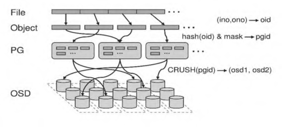

# Ceph 寻址流程

一个大规模分布式存储系统，必须要能够解决两个最基本的问题，

即 “我应该把数据写到什么地方” 与 “我之前把数据写到什么地 方了”，

因此会涉及数据如何寻址的问题。

<figure><figcaption></figcaption></figure>



File是要存储和访问的文件， 它是面向用户的， 也是可直观操作的对象，&#x20;

* 在块存储使用场景， File 指挂载出去使用的 RBD 设备；
* 在对象存储使用场景， File 指用户可见的音视频或其他格式的用户数据；
* 在文件存储使用场景， 和le 指文件系统中存储的用户数据。



Object是Ceph底层RADOS 所看到的对象， 也是在Ceph中数据存储的基本单位， 当File 过大时， 需要将File 切分成统一大小的O切ect进行存储， 每个Object应包含ID、 Binary Data 和Metadata 信息。Object的大小可由RADOS 限定（通常为4MB, 可依据 需要进行配置）。



PG(Placement Group) 是一个逻辑的概念， 它的用途是对 RADOS 层Object的存储进 行组织和位置的映射， 通过PG 概念的引入， Ceph存储系统可以更好地分配数据和定位数据， PG 是Ceph存储系统数据均衡和恢复的最小单位。



Pool 规定了数据冗余的类型，如副本模式、纠删码模式，对千不同冗余类型的数据存储， 需要单独的Pool 划分， 即每个Pool 只能对应一种数据冗余类型的规则。每个Pool 内可包 含多个PG。



OSD(Object Storage Device) 服务负责数据的存取，并处理数据的复制、 恢复、回填、再均衡等任务。



## 关联关系

PG 和Object是一对多的关系， 1 个PG 里面组织若干个O切ect,但是1 个Object只能被映射到1个PG中。

PG 和 OSD 是多对多的关系，1个PG会映射到多个OSD上（依照副本或者纠删码规则）， 每个OSD也会承载多个PG

PG和Pool是多对一的关系，1个Pool内包含多个PG, Pool创建时可指定其中PG 的数量（通常为2的指数次幕），Pool创建之后， 也可以通过命令对其进行调整。
