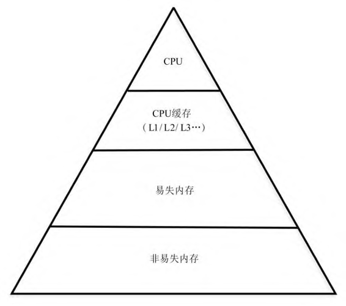

# 开源方案介绍

Linux开源存储的解决方案，包括Linux系统单节点的存储技术和方案（包括本地文件系统）、 分布式存储系统解决方案、软件定义的存储管理软件等。

## Linux单节点存储方案

首先介绍Linux单节点存储方案，包括本地的文件系统，以及通过各 种网络，比如以太网、光纤通道（Fibre Channel，FC）能够导出的服务。



在Linux操作系统中，对于应用程序来讲，所有设备都是以“文件”的 形式使用的。例如，对于网络程序，打开一个socket，其实返回的是一个 文件描述符。如果不关注网络，只从一个应用程序的角度来看文件系 统，则Linux内核文件系统实现如图1-2所示。

<figure><figcaption></figcaption></figure>

应用程序通过系统调用访问文件（无论是块设备文件，还是各种 文件系统中的文件）。可以通过open系统调用，也可以通过memory map 的方式调用来打开文件。

Linux内核收到系统调用的软中断，通过参数检查后，会调用虚拟 文件系统（Virtual File System，VFS），虚拟文件系统会根据信息把相应 的处理交给具体的文件系统，如ext2/3/4等文件系统，接着相应的文件I/O 命令会转化成bio命令进入通用的块设备层，把针对文件的基于offset的读/ 写转化成基于逻辑区块地址（Logical Block Address，LBA）的读/写，并 最终翻译成每个设备对应的可识别的地址，通过Linux的设备驱动对物理 设备，如硬盘驱动器（Harddisk Drive，HDD）或固态硬盘进行相关的读/ 写。&#x20;

用户态文件系统的管理。Linux文件系统的实现都是在内核进行 的，但是用户态也有一些管理机制可以对块设备文件进行相应的管理。 例如，使用parted命令进行分区管理，使用mkfs工具进行文件系统的管 理，使用逻辑卷管理器（Logical Volume Manager，LVM）命令把一个或多个磁盘的分区进行逻辑上的集合，然后对磁盘上的空间进行动态管 理。

简言之，对于Linux操作系统中基于内核文件系统的支持，其实可以 分为两大块：

1. 是内核中虚拟文件系统、具体文件系统、内核通用块设 备及各个I/O子系统的支持；
2. 是Linux用户态与文件系统相关的管理系 统，以及应用程序可以用的系统调用或库文件（Glibc）的支持。&#x20;

当然在用户态也有一些用户态文件系统的实现，但是一般这样的系 统性能不是太高，因为文件系统最终是建立在实际的物理存储设备上 的，且这些物理设备的驱动是在内核态实现的。那么即使文件系统放在 用户态，I/O的读和写也还是需要放到内核态去完成的。除非相应的设备 驱动也被放到用户态，形成一套完整的用户态I/O栈的解决方案，就可以 降低I/O栈的深度，另外采用一些无锁化的并行机制，就可以提高I/O的性 能。

例如， 由英特尔开源的SPDK （ Storage Performance Development Kit）软件库，就可以利用用户态的NVMe SSD（Non-Volatile Memory express）驱动，从而加速那些使用NVMe SSD的应用，如iSCSI Target或 NVMe-oF Target等。



除了本地文件系统，Linux发行版本还自带工具，用于提供基于以太 网、光纤通道的远程存储服务，包括块设备服务、文件系统服务，甚至 是基于对象接口的服务。当然也有一些提供其他存储服务的开源软件。

1. <mark style="color:purple;">**块设备服务**</mark>

Linux 常用的块设备服务主要基于iSCSI （ Internet Small Computer System Interface）和NVMe over Fabrics。

> iSCSI协议是SCSI（Small Computer System Interface）协议在以太网 上的扩展，一台机器通过iSCSI协议即可通过传输控制协议/网际协议 （Transmission Control Protocol / Internet Protocol，TCP/IP）为其他客户提 供共享的存储设备。
>
> 通过iSCSI协议被访问的设备称为Target，而访问 Target的客户（Client）端称为Initiator。
>
> 目前Linux主流的iSCSI Target软件 是基于Kernel的Linux-IO，在用户态可以使用targetcli工具进行管理。当然 还有其他开源的iSCSI Target，如STGT、SCST等。iSCSI常用的iSCSI Initiator工具包括iscsiadm命令和libiscsi、open-iscsi等软件开发包。

NVMe over Fabrics则是NVMe协议在Fabrics上的延伸，主要的设计目 的是让客户端能够更高效地访问远端的服务器上的NVMe盘。相对iSCSI 协议，NVMe over Fabrics则完全是为高效访问基于NVMe协议的快速存储 设备设计的，往往和带有RDMA（Remote Direct Memory Access）功能的 以太网卡，或者光纤通道、Infiniband一起工作。

2. <mark style="color:purple;">**文件存储服务**</mark>

基于不同的协议，在Linux中可以提供很多文件粒度的服务。

例如， 基于网络文件系统（Network File System，NFS）协议的服务，服务器端 可以直接加载支持网络文件系统协议的daemon。网络文件系统协议最早 是由Sun公司在1984年开发的，目前已经发展到了NFSv4。

另外还有基于CIFS（Common Internet File System）的samba服务，使 用这个服务可以向Windows客户端共享文件。这样Windows客户端可以把 一个网络地址挂载成本地一块磁盘。例如，一个地址为192.168.1.8的 Linux服务器导出一个名为XYZ的目录，实际指向/home/XYZ，那么客户 端就可以使用\192.168.1.8\XYZ，但是需要通过samba服务器的用户验 证。



